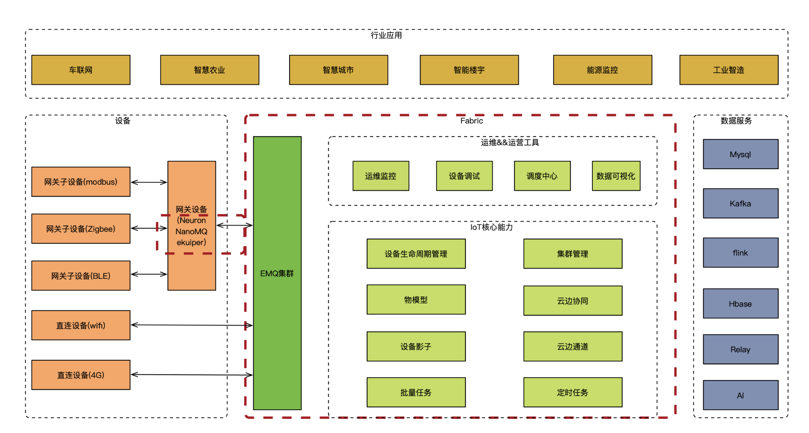

# Fabric 介绍

## Fabric 是什么？

Fabric 是基于 EMQ 核心产品(EMQ X Enterprise、Neuron、NanoMQ、ekuiper、HstreamDB 等)构建的基础 IoT 平台框架，提供设备管理、设备影子、物模型、批量任务、云边协同、集群管理、异地多活等 IoT 平台核心功能，让业务基于 Fabric 快速实现各领域的 IoT 平台、聚焦业务。

## iot 平台架构

如上，fabric 即为图中间红色虚线部份，是承接设备端连接与对上层应用提供核心数据的平台。
