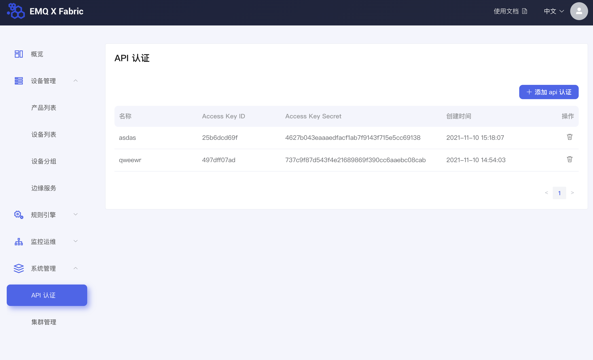

# AK/SK签名认证指南

通过使用Access Key Id / Secret Access Key加密的方法来验证某个请求的发送者身份。Access Key Id（AK）用于标示用户，Secret Access Key（SK）是用户用于加密认证字符串和云厂商用来验证认证字符串的密钥，其中SK必须保密。 AK/SK原理使用对称加解密。

收到用户的请求后，系统将使用AK对应的相同的SK和同样的认证机制生成认证字符串，并与用户请求中包含的认证字符串进行比对。如果认证字符串相同，系统认为用户拥有指定的操作权限，并执行相关操作；如果认证字符串不同，系统将忽略该操作并返回错误码。

## 管理AK/SK

在fabric管理页面上创建、删除自己的AK/SK。



## 使用AK/SK

拿到自己的AK/SK之后，SK需要保密保存。当访问fabric的api时，可以按如下流程使用AK/SK的方式鉴权：

1. 构建http请求；
2. 使用请求内容和使用secret access key计算签名(signature)；
3. 将组合好的Authorization（包含 access key，expire_time，signature) 加入http请求的Header,发送请求到服务端。

### 签名计算方式

- Signature计算方式的伪代码：
```
signature = HexEncode(sha1(Secret Access Key+ExpireTime+URL))
```
> sha1指密钥相关的哈希运算，HexEncode指转十六进制字符串,如果对应的语言sha1计算的结果已经是16进制的字符串，则无需再次转换为16进制的字符串。

1. \[expire_time] 是以秒为单位的时间戳字符串,表示该Signature的过期时间
例如：
`1860490539`

2. URL不包含host内容，一般以/device-manager-services开头， URL包含query参数
例如：
`
/device-manager-services/v0/log/getMessageLog?start_time=1630490339&end_time=1860490539&size=20&offset=0
`


- Authorization header创建伪码：

```
Authorization: Access=[Secret Access Key], ExpireTime=[expire_time], Signature=[signature]
```

1. 需要注意的是算法与Access之前有空格但没有逗号，但是ExpireTime与Signature之前需要使用逗号隔开。

