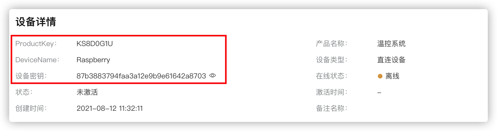
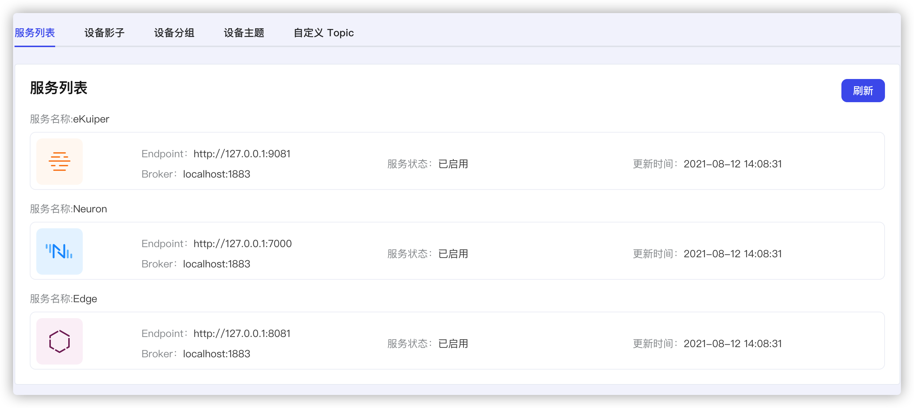
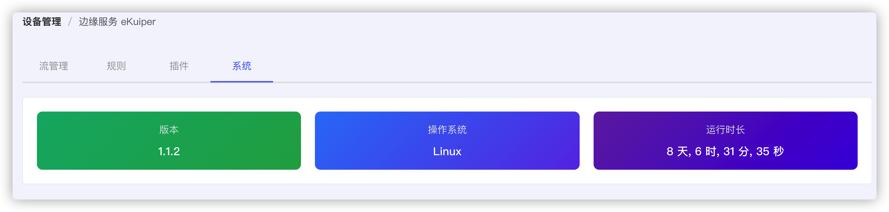
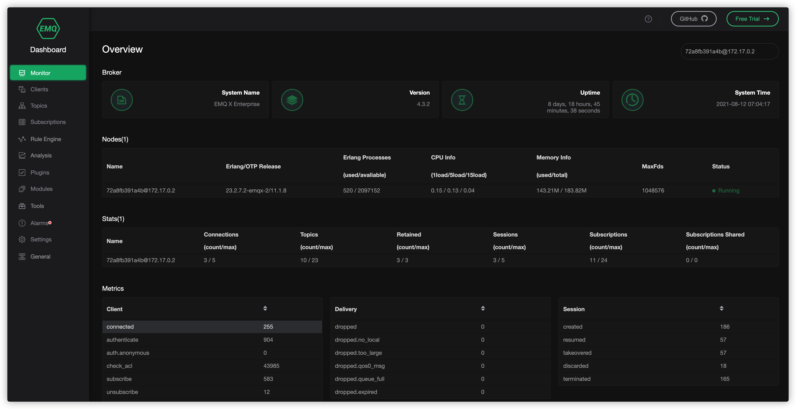

# 云边通道简介

云边通道是基于MQTT协议实现的边缘端设备发现与管理的通道。很多的边端设备都提供了HTTP服务，方便用户在局域网内通过浏览器查看服务的状态或者进行相应的设置。 但是很多时候用户需要从云端对边缘设备提供的HTTP服务进行访问，因为没有工网IP，边缘端提供的HTTP服务无法直接进行访问。通过建立好云边通道，可以实现由云到边的反向HTTP服务的访问。

## 功能

可扩展的云边通道(MQTT)

- 支持配置文件添加组件信息

- 组件状态实时上报

- 边缘端服务的实时响应

  
## 获取edge-agent并编译

[Releases 地址]([Source code(tar.gz)](https://github.com/nanoedge/edge-agent/archive/refs/tags/ci-20210521-091340.tar.gz))

[github 仓库](https://github.com/nanoedge/edge-agent.git)

- 编译

  ```cargo build --release
  cargo build --release
  ```

- 更多编译方式，可参考[github page cross compile](https://github.com/nanoedge/edge-agent/blob/main/docs/zh_CN/cross-compile.md)。

## 前置要求

首先用户需要[创建产品](../quick_start/create_product.md)和[创建设备](../quick_start/create_device)。

## 参数配置

将设备的三元组信息，更新到edge-agent的配置文件config.yaml。



```yaml
---
device_name: Raspberry
product_key: KS8D0G1U 
secret: 87b3883794faa3a12e9b9e61642a8703
observer_interval: 1000
update_interval: 10000

comp_list:
- category: 1
  name: ekuiper_1
  node_type: 3
  endpoint: http://127.0.0.1:9081
  url: http://127.0.0.1:9081/ping
  status: 0
  broker: localhost:1883
  auto_recover: 1
  auto_start: 1
- category: 2
  node_type: 3
  name: neuron_1
  endpoint: http://127.0.0.1:7000
  url: http://127.0.0.1:7000/api/v1/funcno10
  api_version: 1
  status: 0
  broker: localhost:1883
  auto_recover: 1
  auto_start: 1
- category: 3
  node_type: 3
  name: edge_1
  endpoint: http://127.0.0.1:8081
  url: http://127.0.0.1:8081/api/v4
  api_version: 1
  key: 292MY64LSUBEUJVDAGYG
  secret: 92MY64L
  status: 0
  broker: localhost:1883
  auto_recover: 1
  auto_start: 1
```

然后根据边缘端提供的设备，修改```comp_list```，fabric默认提供三种功能，即ekuiper, neuron edge，如果在边缘端有自己的服务，可以加在最后面。

```Yaml
  - category: 4
  node_type: 3
  name: 服务名
  endpoint: 服务地址
  url: 服务的ping接口
  api_version: 版本
  key: 292MY64LSUBEUJVDAGYG
  secret: 92MY64L
  status: 0 状态初始值为0
  broker: 连接到的broker地址
  auto_recover: 是否支持自恢复
  auto_start: 是否支持自启动
```

其中``observer_interval`` 为探测服务的时间间隔，```update_interval```为更新服务时间间隔。更新完配置文件即可启动edge-agent，可以看到边缘端提供的服务已经上线



然后我们点击服务列表中所提供的服务，即可访问对应的服务





