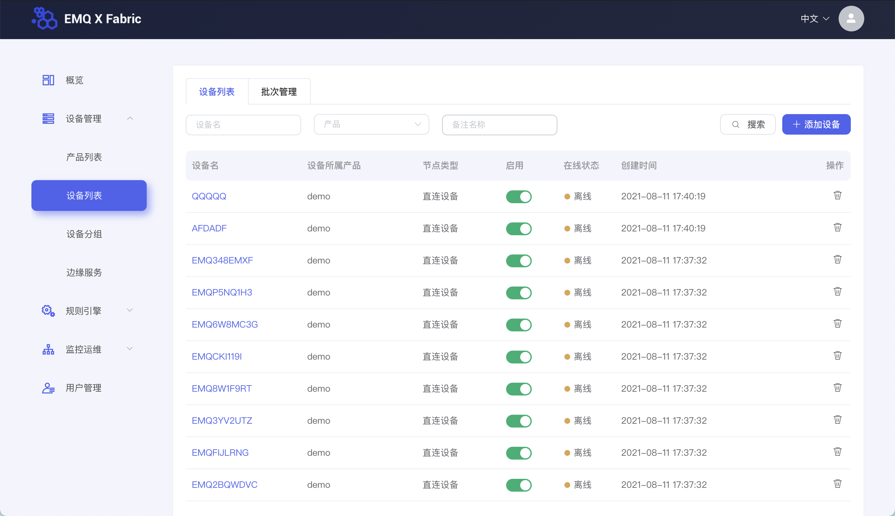
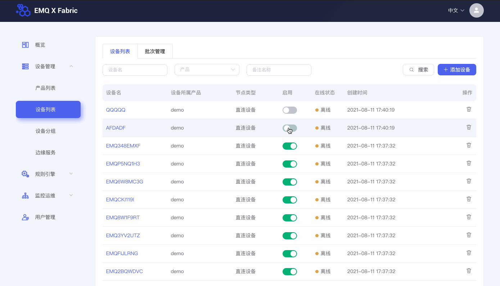
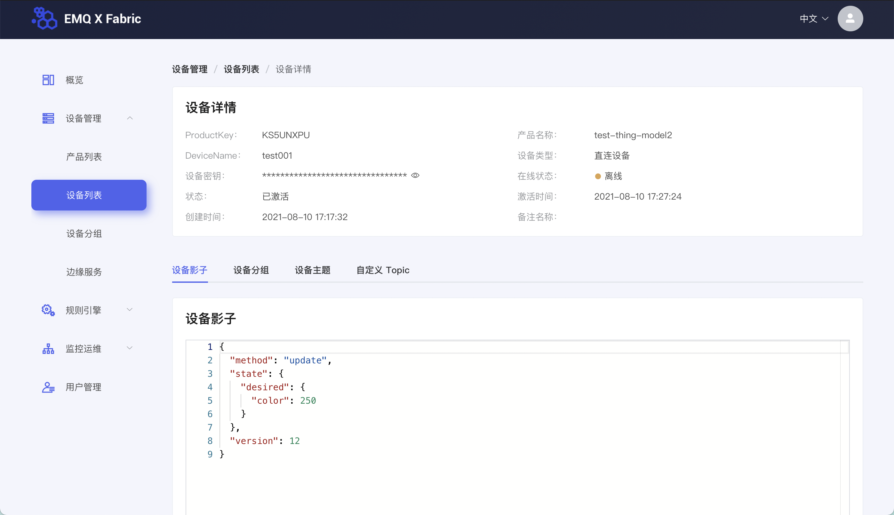
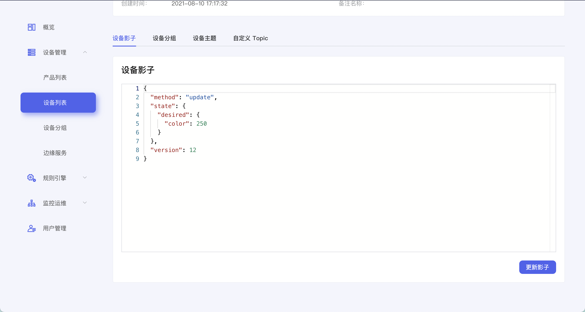
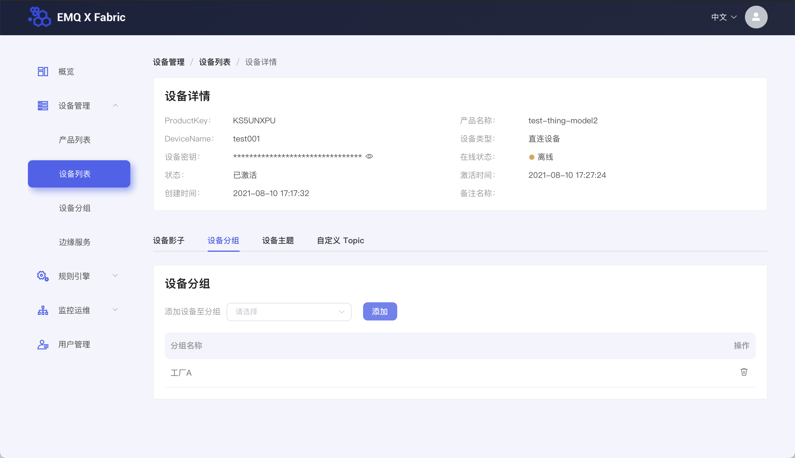
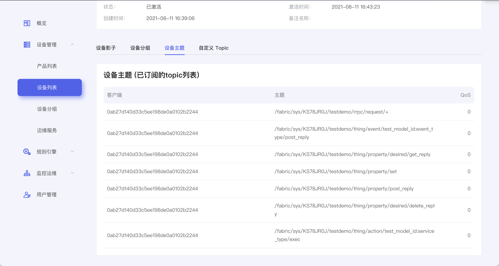
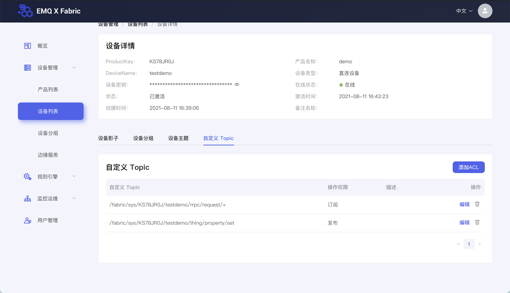
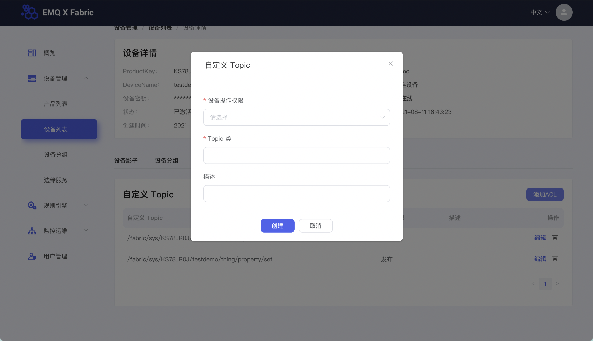
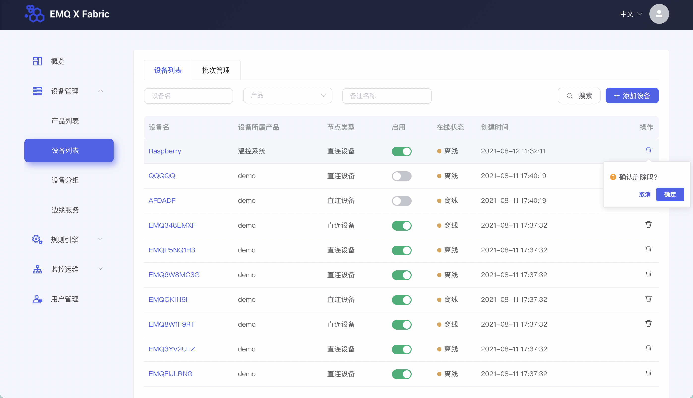
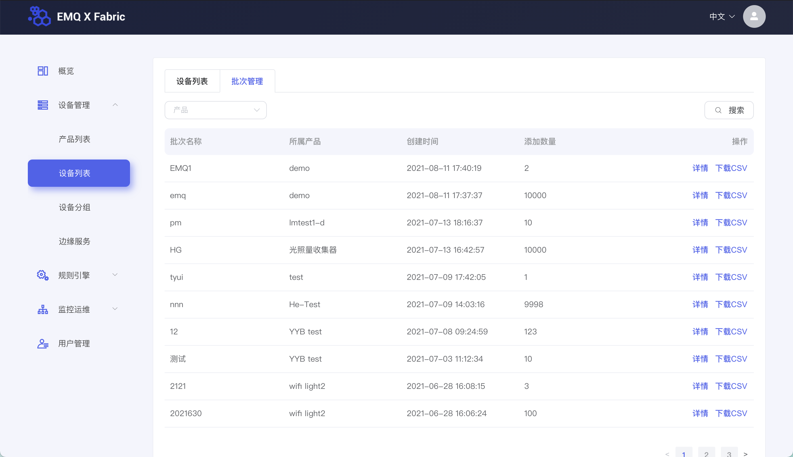

# 设备管理

本节您将学习如何对创建完成的设备进行管理。

## 设备列表

在左侧导航栏找到**设备管理 > 列表**，进入产品页面

## 设备启用停用

停用设备，即停止设备接入平台；启用设备，即重新启用已被停用的设备。

在设备数据表格中，可选择某一设备，对其进行启用/停用操作。

## 查看设备

在设备数据表格中，选择某一设备，点击其设备名，可进入该设备的设备详情页面。

### 设备影子

设备详情下方卡片默认展示设备的设备影子。设备影子是一个JSON文件，用于存储设备的在线状态、设备最近一次上报的设备属性值、应用服务器期望下发的配置。设备可以获取和设置设备影子以此来同步设备属性值，这个同步可以是影子同步给设备，也可以是设备同步给影子。

### 设备分组

设备详情下方卡片活动 Tab 切换至**设备分组**，可以看到当前设备都属于哪些设备分组。设备分组可用于对设备进行管理，如，将工厂 A 的所有设备放入工厂 A 分组。

### 设备主题

设备详情下方卡片活动 Tab 切换至**设备主题**，可以看到当前设备已经订阅了哪些topic，可通过该这些topic从客户端发布一条消息到设备端。

### 自定义Topic

设备详情下方卡片活动 Tab 切换至**设备主题**，可查看当前设备已添加的自定义Topic。

可点击卡片右上角添加 **ACL 按钮**，根据指引添加自定义 Topic。

## 删除设备

可在设备列表页面，删除已添加的设备。

## 批次管理

创建设备时，通过**批量创建设备**和**批量导入设备**的数据可在**设备列表**页面的**批次管理**页签下查看，查看该批次设备的**添加数量**和设备列表（包含设备证书和状态等信息）。

