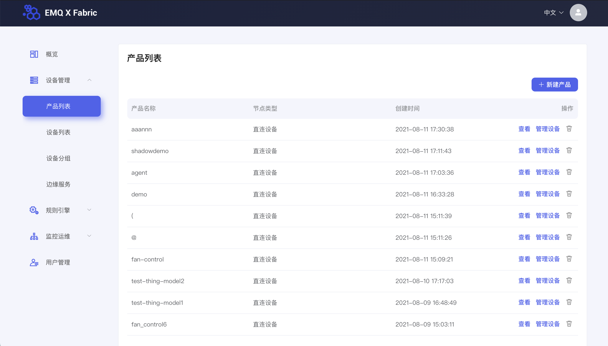
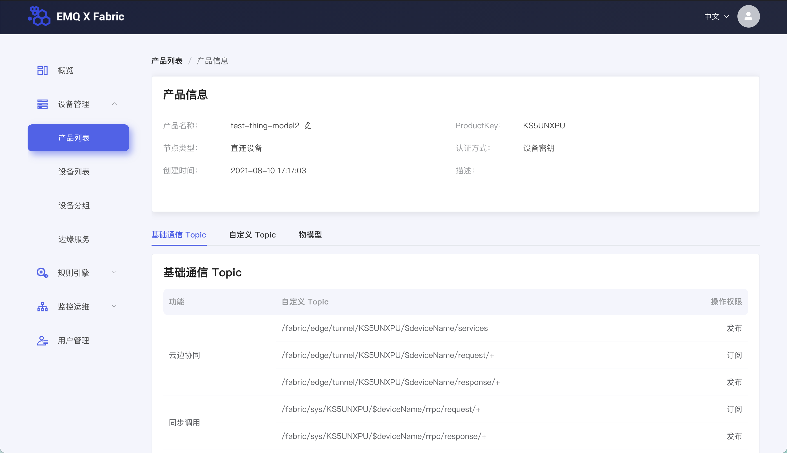
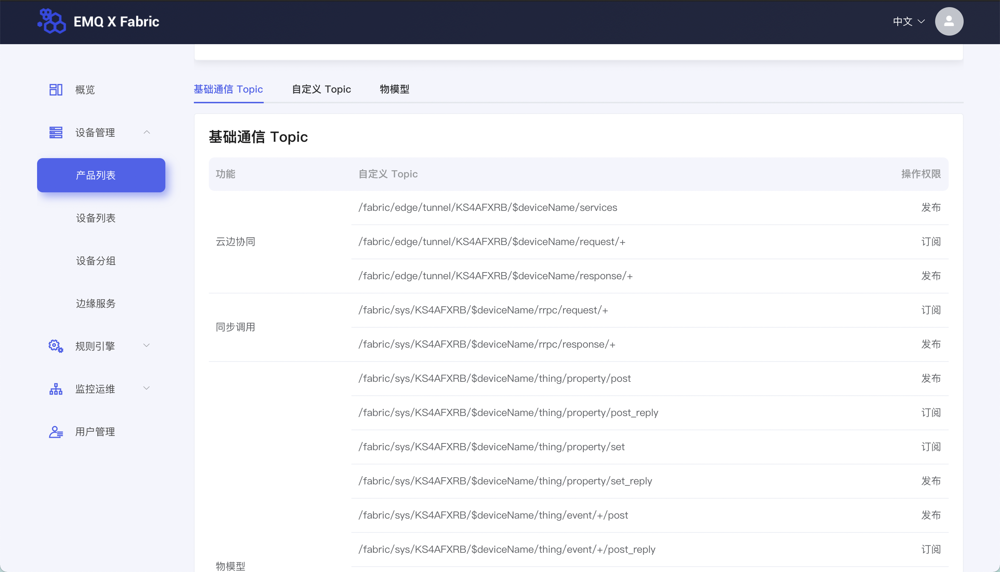
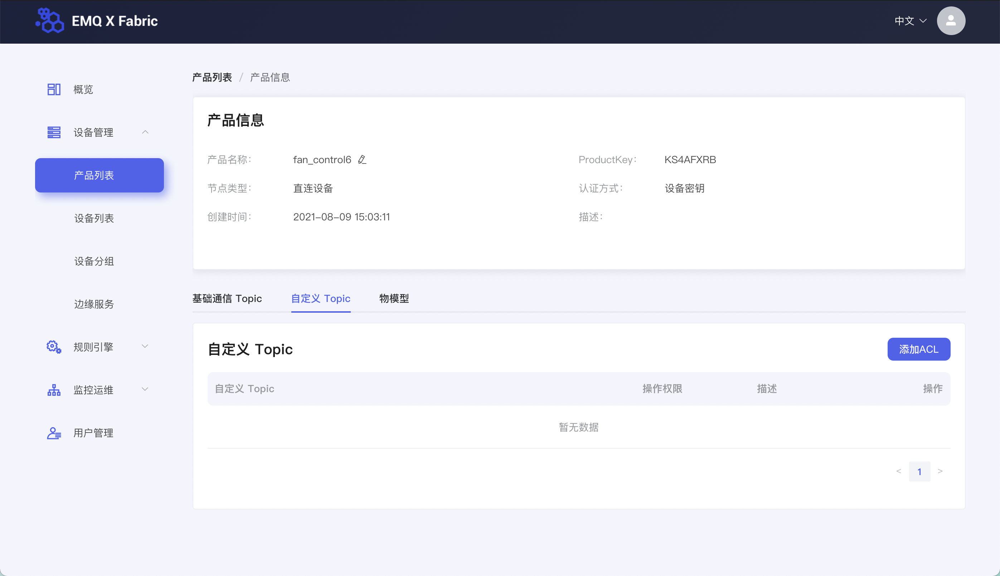
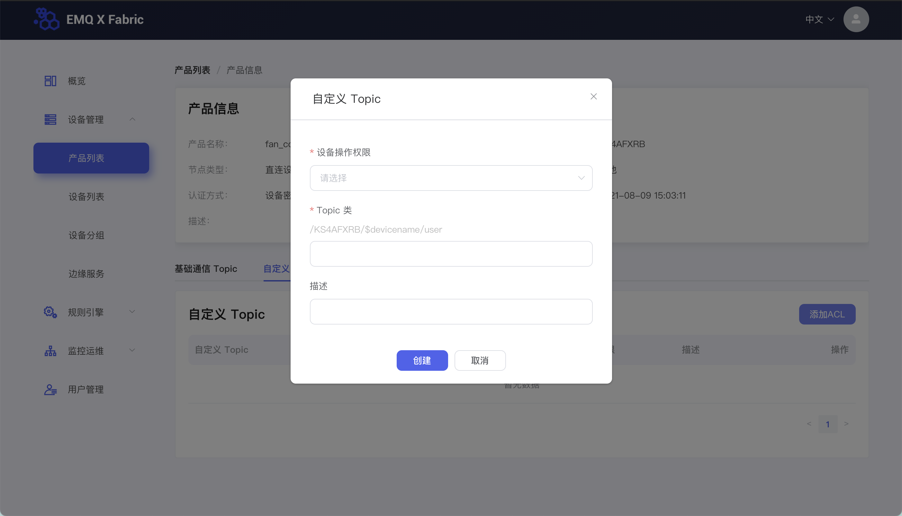
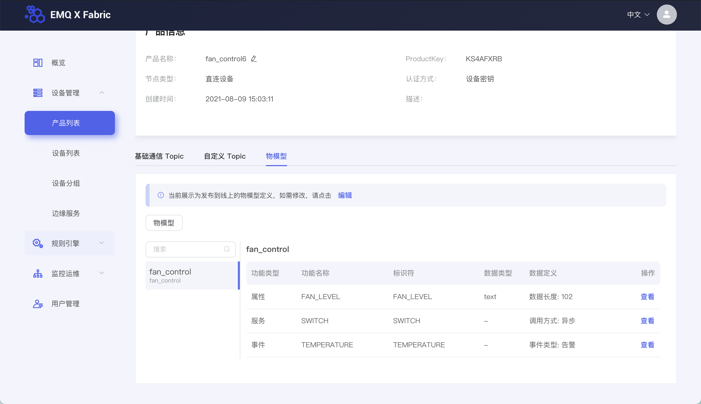
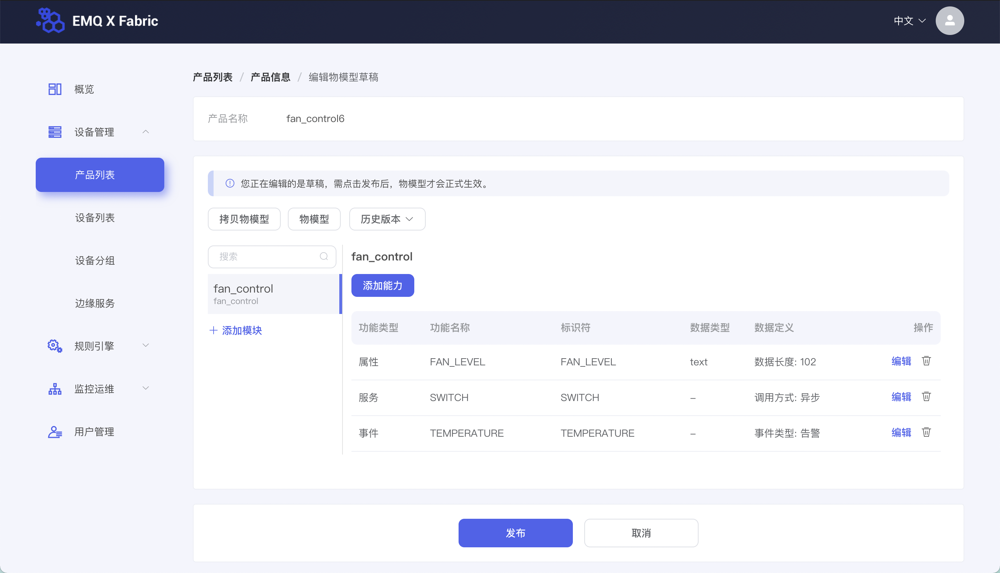
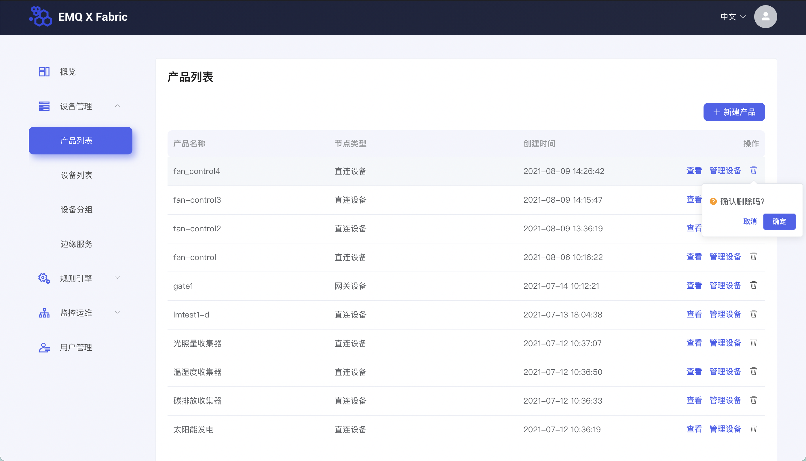

# 产品管理

本节您将学习如何对创建完成的产品进行管理。

## 查看产品

在左侧导航栏找到**设备管理 > 产品列表**，进入产品页面

### 基本信息

在产品数据表格中，选择某一产品，点击表格行右侧的**查看**按钮，进入产品详情页面。

上方卡片展示了当前产品的基本信息，包括产品名称、ProductKey、节点类型、联网方式、认证方式、产品的创建时间及描述。

### 基础通信Topic

下方卡片默认展示该产品基础通信 Topic，可通过这些 Topic 对该产品设备实现消息的订阅或发布。

### 自定义Topic

下方卡片切换活动 Tab 至 **自定义 Topic**，可看到该产品下的自定义 Topic。

可点击右上角**添加 ACL**按钮，添加自定义 Topic，实现对该产品设备自定义的消息发布和订阅。

### 物模型

下方卡片切换活动 Tab 至 **物模型**，可看到描述该产品功能的物模型数据。

可点击**编辑**按钮，对产品物模型进行编辑，物模型详情请看[物模型](../device_manager/thingmodel/add_thing_model.md)。

## 删除产品

在产品列表页可对产品进行删除。

