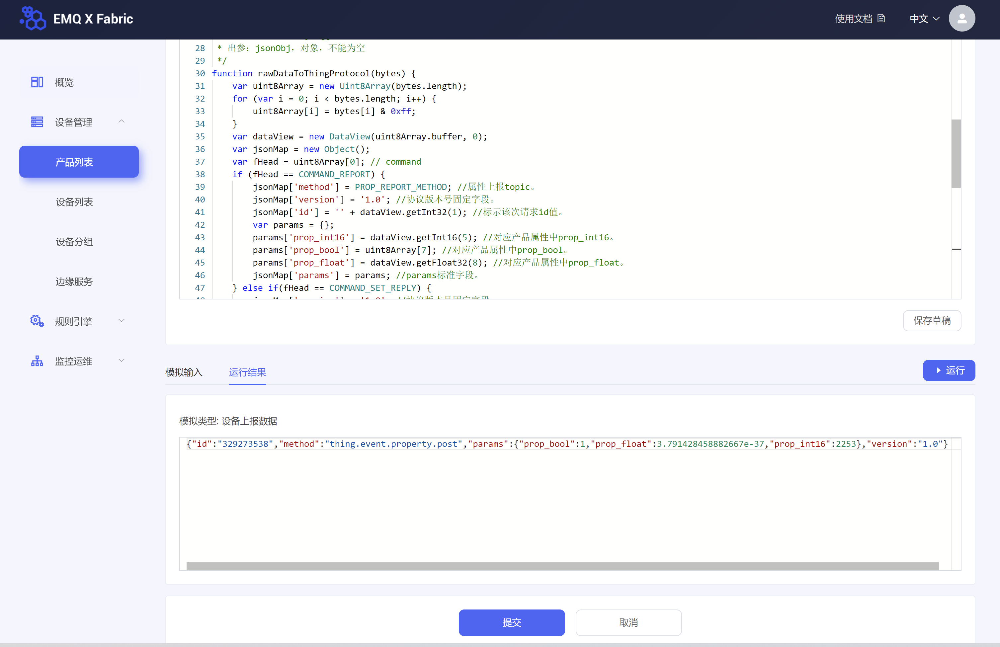

# 物模型数据解析使用示例
本文以解析上、下行属性数据的脚本为例，介绍如何编写脚本用于解析自定义数据格式的物模型。

## 编写脚本
1. 登录平台
2. 在左侧导航栏，选择设备管理 > 产品列表。
3. 在产品页，单击产品对应的名称跳转至产品详情页。
4. 在产品详情页，选择数据解析页签。
5. 选择编辑进入脚本编辑页，在输入框中输入脚本。
6. 目前仅支持 JavaScript（ECMAScript 5） 脚本语言。

脚本中需定义调用以下两个函数，分别用于解析上、下行物模型数据。  
* 下行物模型数据
  * 将平台下发的 JSON 格式数据转为设备自定义数据格式的函数：`protocolToRawData(jsonObj)`
  * 平台下发物模型数据的 topic 为 `/fabirc/sys/${product_key}/${device_name}/model/up_raw_reply`
* 上行物模型数据
  * 将设备上报的自定义数据格式转为 JSON 格式数据的函数：`rawDataToProtocol(bytes)`
  * 设备上报自定义数据格式的物模型数据的 topic 为 `/fabric/sys/${product_key}/${device_name}/model/up_raw`

**说明** _设备实际上报数据时，需要在 topic 末尾携带特殊标记`@sn=raw`，平台才会调用脚本解析数据_  

完整的示例脚本，请参考[JavaScript脚本示例](javascript_use_case.md)

## 在线测试脚本
脚本编辑完成后，在模拟输入下，选择模拟类型，输入模拟数据在线测试脚本。
* 模拟解析设备上报的属性数据。  
  选择模拟类型为**设备上报数据**，输入以下模拟的设备上报数据，然后单击**运行**。  
  您可使用字符串转十六进制工具，将待传入参数 JSON 格式数据转为十六进制格式数据。例如转化后为00002233441232013fa00000，则输入如下数据。  
  `0x00002233441232013fa00000`  
  单击**运行结果**，查看解析结果。  
  ```json
  {
      "method": "thing.property.post",
      "id": "2241348",
      "params": {
          "param_float": 1.25,
          "param_int16": 4658,
          "param_bool": 1
        },
      "version": "1.0"
  }
  ```
  
* 模拟解析平台下发的返回结果数据。  
  选择模拟类型为**平台下发数据**，输入以下 JSON 格式数据，然后单击**运行**。  
  ```json
  {
      "id": "12345",
      "version": "1.0",
      "code": 200,
      "method": "thing.property.post",
      "data": {}
  }
  ```
## 提交脚本
脚本正确执行并返回预期的 JSON 数据后，单击**提交**，将脚本提交到平台  

**说明** _只有脚本正确执行后，**提交**按钮才可用。脚本提交后才能生效。脚本未完成时，可以选择**保存草稿**。_