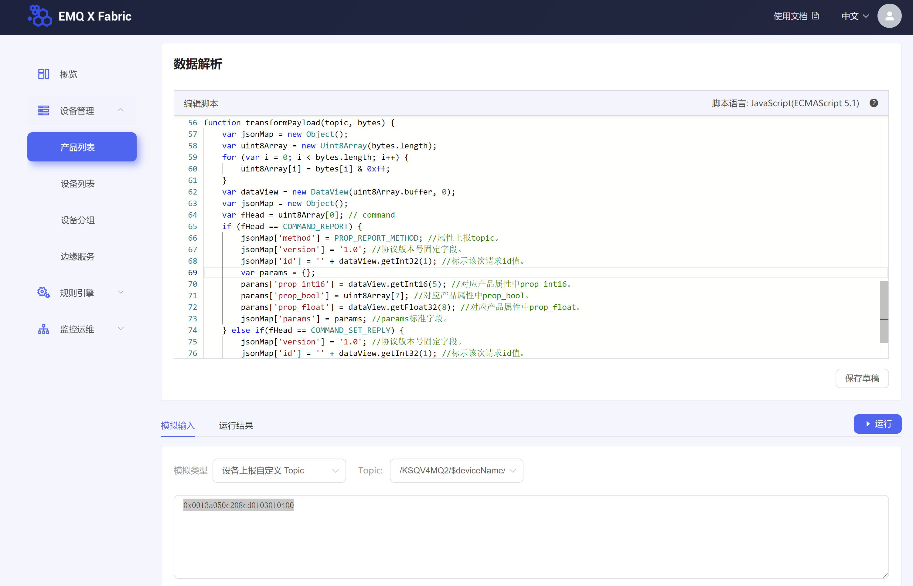

# 提交数据解析脚本

设备通过携带特殊标记`@sn=raw`的自定义 topic 上报数据，平台收到数据后，
调用用户上传的数据解析脚本，将自定义格式数据转换为 JSON 格式数据，再转发至后续的业务系统。

## 说明
* 仅解析设备上报到平台的数据，不解析平台下发的数据。
* 后续的业务系统收到的 payload 都是经由数据解析脚本转换后的数据。
* 后续的业务系统收到的 topic 不包含任何特殊标记。例如，设备上报的 topic 
为`/$product_key/$device_name/user/xxx@sn=raw`，经由脚本处理后，转发出去的 topic 为 `/$product_key/$device_name/user/xxx`

## 添加自定义 topic
**在平台添加自定义 topic 时按照正常 topic 的格式来定义，不需要添加特殊标记。**

## 操作步骤
1. 登录平台

2. 在左侧导航栏，选择**设备管理** > **产品列表**。
3. 在产品页，单击产品对应的名称跳转至产品详情页。
4. 在产品详情页，选择**数据解析**标签页。
5. 选择**编辑**进入脚本编辑页，在输入框中输入脚本。
6. 目前仅支持 JavaScript（ECMAScript 5） 脚本语言。

脚本中需定义调用函数：  
`transformPayload(topic, bytes)`

完整的示例代码，请参见[JavaScript脚本示例](./javascript_use_case.md)。

7. 测试脚本。
  
模拟输入下，选择模拟类型为**设备上报自定义Topic**，并选择自定义 topic。
输入模拟的设备上报数据，单击**执行**。
脚本正确执行并返回预期的 JSON 数据后，单击**提交**，将脚本提交到平台。

**说明** _只有脚本正确执行后，**提交**按钮才可用。脚本提交后才能生效。脚本未完成时，可以选择**保存草稿**。_