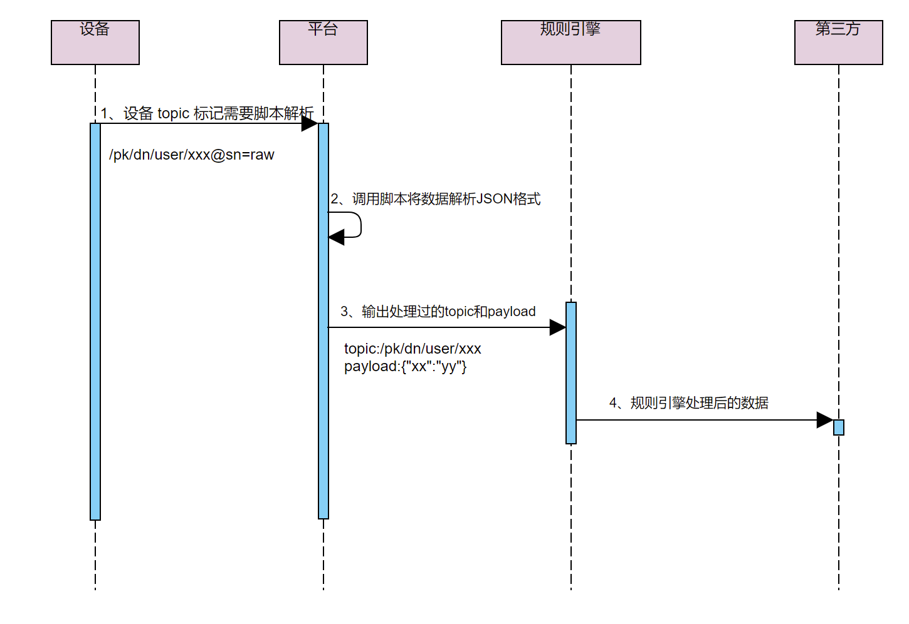
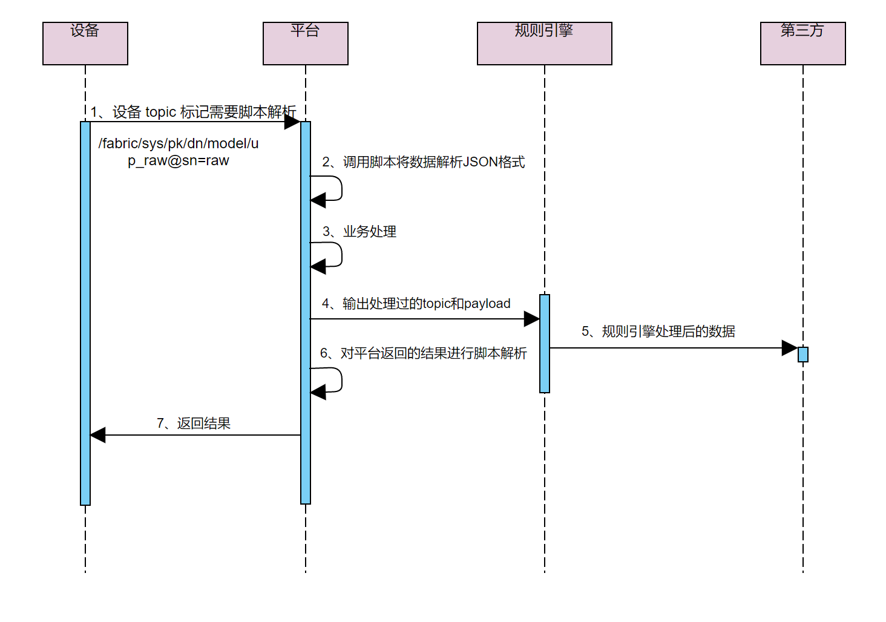
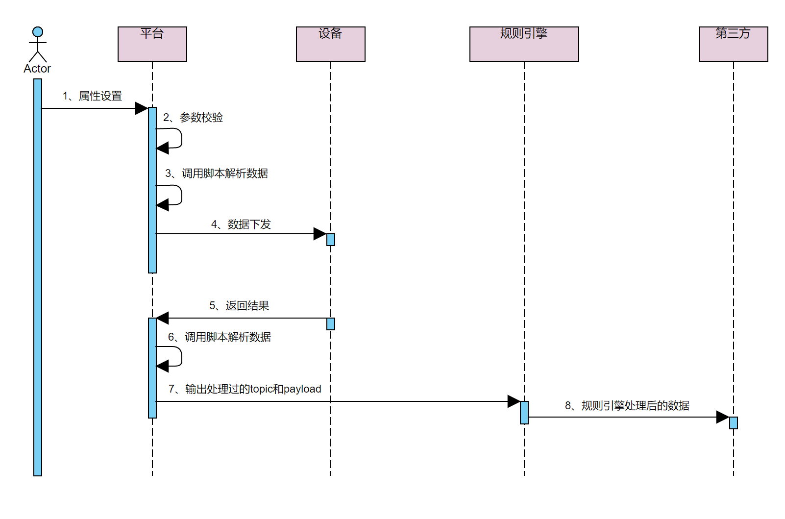

# 什么是数据解析
平台定义的标准数据格式为 JSON，但对于配置较低且资源受限或者对网络流量有要求的设备，
不适合直接构造 JSON 数据与平台通信，可将原始数据透传到平台。平台提供数据解析功能，
可以根据用户提交的脚本，将数据在设备自定义格式和 JSON 格式之间转换。

目前支持的数据解析的数据类型：
* 按照平台约定格式定义的自定义 topic 的上行数据，即将设备通过自定义 topic 上报给平台的自定义格式的 payload 解析为 JSON 格式。  
  平台约定的自定义 topic 组成格式为：`/$product_key/$device_name/user/xxx`
* 上、下行物模型 topic 的数据，即将设备上报给平台的自定义物模型数据解析为 JSON 格式，以及将平台下发给设备的 JSON 格式数据解析为设备能识别的自定义格式。
  * 自定义物模型格式的上行 topic 格式为：`/fabric/sys/$product_key/$device_name/model/up_raw`
  * 自定义物模型格式的下行 topic 格式为：`/fabric/sys/$product_key/$device_name/model/up_raw_reply`
* 非按照平台约定格式定义的自定义 topic 的上行数据，即将设备通过自定义 topic 上报给平台的自定义格式的 payload 解析为 JSON 格式。

使用平台约定格式定义的 topic 的上行数据，以及自定义数据格式的物模型的上行数据，要想使用数据解析功能，
必须在 topic 末尾携带特殊标记`@sn=raw`，才会触发数据解析流程。例如：  
```
/$product_key/$device_name/user/xxx@sn=raw
/fabric/sys/$product_key/$device_name/model/up_raw@sn=raw
```  

_数据解析完成后，特殊标记将从 topic 中移除，最终流转出去的 topic 将不携带任何特殊标记_

不按照平台约定格式定义的 topic，不需要在末尾携带特殊标记。该类型数据适合已开发完成的设备不需要任何修改即可无缝接入平台。  
**出于性能的考虑，该数据类型的解析功能默认关闭，需手动修改服务端配置才可开启**

## 自定义 topic 数据解析
设备通过自定义 topic 上报数据，且 topic 末尾携带特殊标记（@sn=raw）时，平台接收数据后，将会调用用户在平台提交的数据解析脚本，
对设备上报的 payload 解析为 JSON 结构体，再进行业务处理。
数据解析流程图：


自定义 topic 数据解析脚本编写方法，请参考：  
[提交数据解析脚本](user_defined_topic_data_parsing/post_data_parsing_script.md)  
[JavaScript脚本示例](user_defined_topic_data_parsing/javascript_use_case.md)

## 物模型数据解析
设备使用自定义格式上报物模型数据或者平台下发物模型数据时，平台将调用用户提交的数据解析脚本，
将数据解析为平台定义的 JSON 格式和设备的自定义数据格式。

设备上报自定义格式的物模型数据流程图：


调用设备服务或设置属性的数据流程图：


物模型数据解析脚本示例，请参考：  
[物模型数据解析示例](user_defined_thing_model_data_parsing/thing_model_data_parsing_user_case.md)  
[JavaScript脚本示例](user_defined_thing_model_data_parsing/javascript_use_case.md)