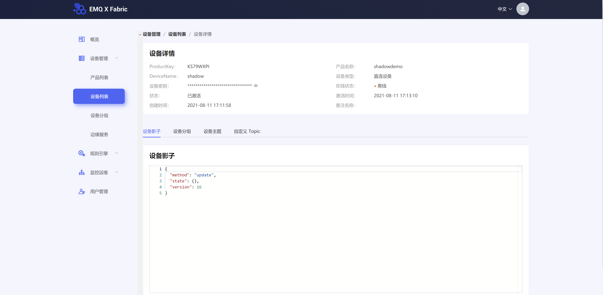

## 设备影子介绍
平台提供设备影子功能，用于保存设备即时状态。应用程序可对影子状态进行设置，设备在线时，可直接获取到平台下发的设置指令；设备离线后，再次上线时可以主动查询影子配置。

## 使用场景
设备影子以 json 结构化的方式保存在平台，分为应用程序设置的期望值以及设备上报的状态值。
每个设备只有一个即时的设备影子副本，仅保存最后一次设置的期望值和设备上报的状态值。

设备影子可以应用于以下场景：
-  弱网环境，设备频繁上下线
   由于网络不稳定，造成设备与平台的连接时断时续，设备离线时，应用程序无法下发指令获取设备实时状态，影响应用程序相关业务功能的运行
- 多程序并发请求获取设备状态
  当多个应用程序发起请求获取设备状态时，即使设备状态未发生改变，也必须一一响应，如果设备的处理能力有限，可能无法及时处理较多的并发请求。
  使用设备影子功能，设备仅需在状态发生变化时主动上报一次到平台，应用程序获取设备影子时，平台即可立即返回数据，无需与设备发生指令交互。
- 设备离线
    - 当设备因为网络不稳定而离线时 ，应用程序下发的控制指令无法送达设备。
    - 使用QOS=1或者2实现，但是该方式对服务器压力较大
    - 使用设备影子功能，由平台缓存控制指令，指令中携带时间戳 ，当设备重新上线时，主动获取设备影子状态，并根据时间戳判断是否执行

## 查看和更新设备影子
*查看设备影子功能待完善*

操作步骤：
1. 登录 Fabric 控制后台
2. 在左侧导航栏选择 **设备管理**
3. 单击对应设备的 **名称** 按钮即可跳转至设备详情页  

5. 点击 **设备影子**，页面显示应用程序或用户最后一次下发的设置指令
6. 用户可直接编辑输入框，填写影子期望状态，格式请参考 [设备影子JSON格式](https://github.com/emqx/fabric-docs/tree/main/zh_CN/device_manager/ "设备影子JSON格式")
    - 设备在线时，平台将保存期望状态，设备通过订阅相关 topic 直接获取期望状
    - 设备离线时，平台将缓存期望状态，设备上线后通过发送相关 topic 主动获取期望状态
