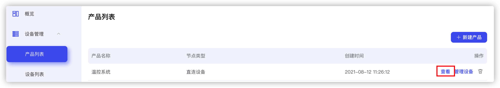
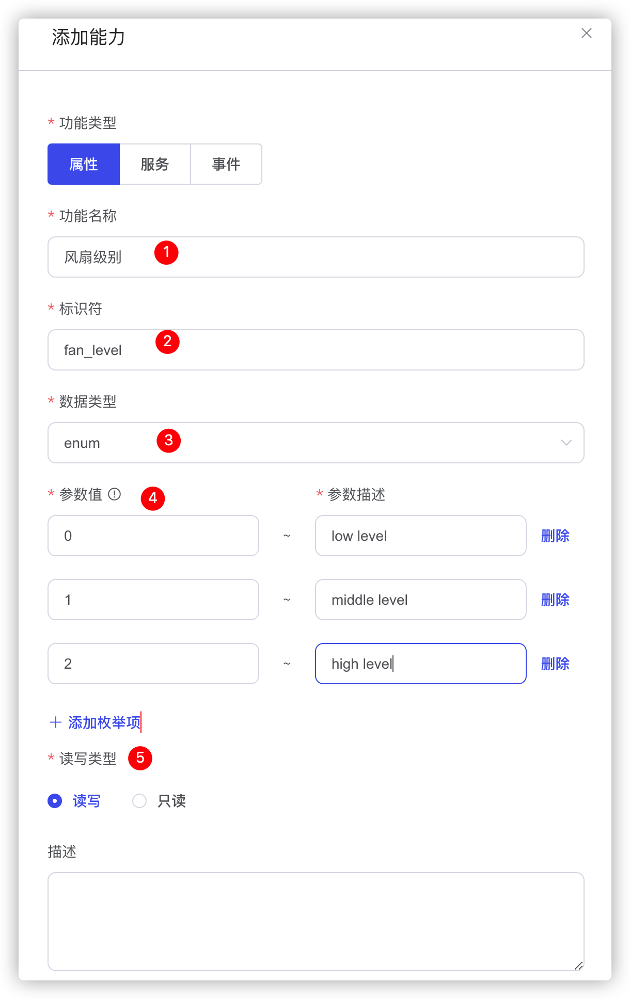

物模型为产品定义了三种基本抽象，属性，服务，事件，以便于边缘的产品与云端进行数据交互和管理。

## 使用说明
* 每个产品可以添加任意多个自定义模块
* 编辑物模型后，需要发布才能生效
* 可以通过恢复某个历史版本继续编辑
* 可以将其他同类型产品的最后一次发布的物模型拷贝至当前产品，拷贝时将清空当前产品未发布的物模型

## 创建产品

登陆EMQ X Fabric 物联网平台，常见产品具体参见[创建产品](./create_product.md)

## 创建设备

创建设备具体参见[创建设备](./create_device.md)

## 创建物模型

下面我们以基于树莓派的温控系统为例，在上面的产品和设备都创建好以后，点击产品列表，查看刚刚创建好的设备。

选择物模型，点击编辑，点击**添加模块**

| 参数  | 说明  |
| :------------ | :------------ |
| 模块名称  | 支持英文、数字和下划线，长度限制为4~30个字符 |
| 模块标识符 | 支持英文、数字和下划线，长度限制为1~30个字符 |
| 模块描述 | 对模块进行说明或者备注，最多4096个字符 |

* 可以选择从历史版本下拉菜单选择某个已发布的历史版本，再点击**恢复此版本**，并在此版本的基础上进行编辑  
_注意：恢复历史版本将完全覆盖当前正在编辑且未发布的所有模块信息_

* 添加属性，在自定义能力的对话框中，选择属性类型，填写相关参数，单击确认。

<table>
<tr> <td>参数</td> <td>说明</td> </tr>
<tr>
    <td>名称</td>
    <td>支持英文、数字和下划线，必须以数字或者字符开头及结尾，长度限制为4~30个字符，同一模块下名称不能重复。</td>
</tr>
<tr>
    <td>标识符</td>
    <td>支持英文、数字和下划线，必须以数字或者字符开头及结尾，长度限制为1~30个字符</td>
</tr>
<tr>
    <td>数据类型</td>
    <td> 
        

            <li>int32: 32位整型，可选定义取值范围和单位符号</li>
            <li>float: 单精度浮点型，可选定义取值范围和单位符号</li>
            <li>double: 双精度浮点型，可选定义取值范围和单位符号</li>
            <li>enum: 枚举型，定义枚举项的参数值和参数描述</li>
            <li>bool: 布尔型，包含0和1两种参数，可自定义参数描述</li>
            <li>text: 文本字符串，需定义字符串长度，支持1~10240个字节</li>
            <li>date: 时间戳，格式为string类型的UTC时间戳，单位毫秒</li>
            <li>struct: 结构体，可嵌套除结构体和数组以外的基本类型参数</li>
            <li>array: 数组，需定义数组元素个数和元素类型，不可嵌套数组。元素个数1~50</li>
        

    </td>
</tr>
<tr>
    <td>取值范围</td>
    <td>数据类型为int、float及double时可设置取值范围</td>
</tr>
<tr>
    <td>单位</td>
    <td>选填，自定义参数单位描述</td>
</tr>
<tr>
    <td>读写类型</td>
    <td>
        

            <li>读写: 该方式的属性支持查询和设备设置</li>
            <li>只读: 该方式的属性仅支持由设备端上报，应用程序查询</li>
        

    </td>
</tr>
<tr>
    <td>描述</td>
    <td>对该属性进行说明或备注。长度限制为4096个字符</td>
</tr>
</table>

* 添加方法，在自定义能力的对话框中，选择方法类型，填写相关参数，单击确认。

<table>
<tr> <td>参数</td> <td>说明</td> </tr>
<tr>
    <td>名称</td>
    <td>支持英文、数字和下划线，必须以数字或者字符开头及结尾，长度限制为4~30个字符，同一模块下名称不能重复。</td>
</tr>
<tr>
    <td>标识符</td>
    <td>支持英文、数字和下划线，必须以数字或者字符开头及结尾，长度限制为1~30个字符</td>
</tr>
<tr>
    <td>调用方法</td>
    <td> 
        

            <li>异步: 应用程序调用设备异步方法，平台发送执行指令后立即返回，不会等待设备的响应</li>
            <li>同步: 应用程序调用设备同步方法，平台发送执行指令后需等待响应，如设备没有响应，则返回超时错误</li>
        

    </td>
</tr>
<tr>
    <td>输入参数</td>
    <td>
         

            <li>不能使用平台保留字段作为参数标识符：set、get、post、time、value</li>
            <li>一个服务最多支持定义20个入参</li>
        

    </td>
</tr>
<tr>
    <td>输出参数</td>
    <td>
         

            <li>不能使用平台保留字段作为参数标识符：set、get、post、time、value</li>
            <li>一个服务最多支持定义20个入参</li>
        

    </td>
</tr>
<tr>
    <td>描述</td>
    <td>对该方法进行说明或备注。长度限制为4096个字符</td>
</tr>
</table>

* 添加事件，在自定义事件的对话框中，选择事件类型，填写相关参数，单击确认。

<table>
<tr> <td>参数</td> <td>说明</td> </tr>
<tr>
    <td>名称</td>
    <td>支持英文、数字和下划线，必须以数字或者字符开头及结尾，长度限制为4~30个字符，同一模块下名称不能重复。</td>
</tr>
<tr>
    <td>标识符</td>
    <td>支持英文、数字和下划线，必须以数字或者字符开头及结尾，长度限制为1~30个字符</td>
</tr>
<tr>
    <td>事件类型</td>
    <td> 
        

            <li>信息: 设备运行时的一般性通知</li>
            <li>告警: 设备运行时的告警类通知</li>
            <li>故障: 设备运行时的故障类通知</li>
        

    </td>
</tr>
<tr>
    <td>输出参数</td>
    <td>
         

            <li>不能使用平台保留字段作为参数标识符：set、get、post、time、value</li>
            <li>一个服务最多支持定义20个入参</li>
        

    </td>
</tr>
<tr>
    <td>描述</td>
    <td>对该方法进行说明或备注。长度限制为4096个字符</td>
</tr>
</table>

