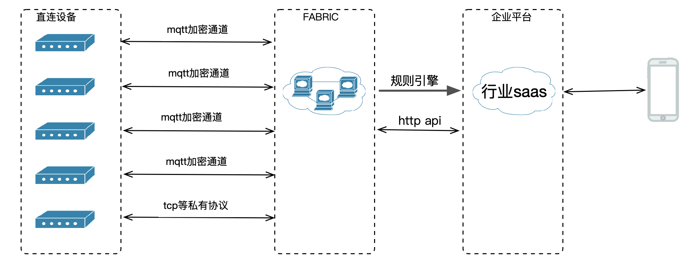
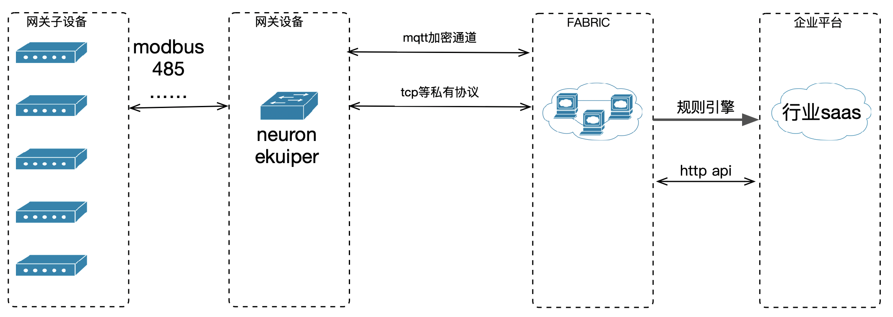

# 应用场景

fabric能够支撑海量设备接入，同时从架构上支持集群水平扩展、异地多活、就近接入等核心能力。下面介绍fabric 的一些典型应用场景

## 应用场景一(直连设备)

该场景为设备直连fabric平台。
设备连接平台后会将设备上的属性、事件等信息上报到云端，通过规则引擎把数据落地到业务平台的数据服务，移动端通过行业saas可对设备数据进行查看或者指令下发(fabric 提供指令同步下发接口)。
典型应用场景：
1. 智能音箱
2. 共享单车
3. 智能电表
4. 摄像头(信令)
5. 直播弹幕
6. 等其他应用场景

## 应用场景二(网关子设备)

该场景主要为网关子设备的应用场景
网关子设备为一些传感器，如温度、湿度、振动、光照等，此类设备一般不具备联网能力，需借助网关设备与平台进行连接，网关设备通过neuron对modbus等数据进行采集后，可使用ekuiper在边缘对数据进行计算、清洗，再经mqtt把数据上报到云端。
典型应用场景：
1. 工业领域各种传感器设备
2. 农业设备
3. 其他网关子设备场景