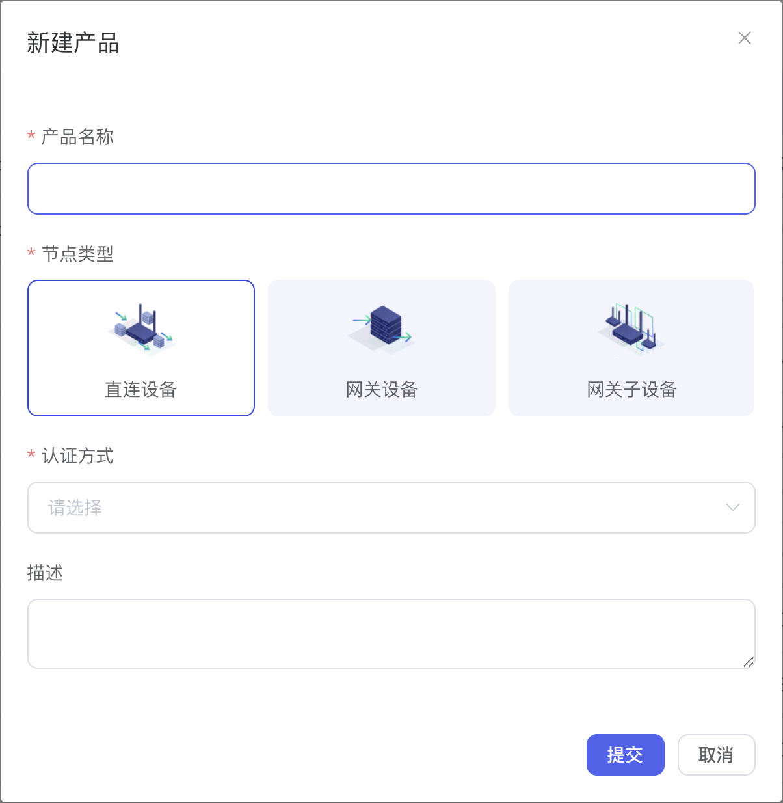

# 创建产品
本节您将学习如何创建一类产品。使用 Fabric 的第一步是在 Web 页面上创建产品，产品是相同功能定义的设备集合，例如，产品指同一个型号的产品，设备就是该产品型号下的某个设备。

### 步骤

1. 登录 Fabric 控制台。
2. 在左侧导航栏，选择**设备管理 > 产品列表**。
3. 点击右上角**新建产品**按钮，创建产品。
4. 根据页面指引填写信息，点击提交。
   
   

| 参数     | 描述                                                         |
| -------- | ------------------------------------------------------------ |
| 产品名称 | 产品的名称，支持中文、英文、数字、下划线（_）、短横线（-）、at（@）和英文圆括号，长度限制1～60个字符 |
| 节点类型 | 产品下设备的类型  - **直连设备**：直连物联网平台，且不能挂载子设备，但能作为子设备挂载到网关下的设备。  - **网关设备**：可以挂载子设备的直连设备。网关具有子设备管理模块，可以维持子设备的拓扑关系，将与子设备的拓扑关系同步到云端。  - **网关子设备（ v0.6.0 尚未支持）**：不直接连接物联网平台，而是通过网关设备接入物联网平台的设备。 |
| 认证方式 | 设备接入物联网平台的安全认证方式。产品创建成功后，认证方式不可变更。可选： - **设备密钥**：使用物联网平台为设备生成的DeviceSecret进行设备认证签名计算。 - **X.509证书（ v0.6.0 尚未支持）**：使用X.509数字证书进行设备身份认证。 |
| 描述     | 描述产品信息                                                 |

