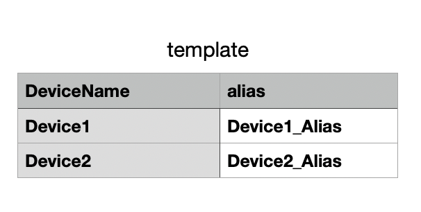

# 创建设备
本节您将学习如何创建设备。创建产品完成后，需要在产品下添加设备。您可使用创建单个设备、批量创建设备和批量导入设备来进行设备的创建。其中通过批量创建设备和批量导入设备来完成创建的设备，可以进行设备的批次管理。

## 创建单个设备
1. 在右侧导航栏找到**设备管理 > 设备列表**，点击进入设备列表页。
2. 点击右上**添加设备**按钮，进入创建设备方式选择页面。

   

3. 点击**添加单个设备**按钮。
4. 根据页面指引填写信息，点击提交。

   

| 参数     | 描述                                              |
| -------- | ------------------------------------------------- |
| 设备名   | 设备的名称，可使用英文字母及数字，长度限制为 4~10 |
| 产品     | 设备所属产品                                      |
| 标签     | 用来描述设备的关键词                              |
| 备注名称 | 设备的备注名称                                    |

## 创建批量设备

1. 在右侧导航栏找到**设备管理 > 设备列表**，点击进入设备列表页。
2. 点击右上**添加设备**按钮，进入创建设备方式选择页面。
3. 点击**创建批量设备**按钮。
4. 根据页面指引填写信息，点击提交。

   

| 参数       | 描述                                                         |
| ---------- | ------------------------------------------------------------ |
| 设备名前缀 | 批量创建的设备名称前缀，创建完毕后，所有通过这次批量创建操作创建出来的设备，都将带上此前缀。 支持英文字母及数字，长度限制为 1~4 可用来区分不同次批量创建操作创建出来的设备。 |
| 产品       | 设备所属产品                                                 |
| 批次名称   | 创建成功后可根据此名称在设备批次管理中查看该批次设备及下载该批次设备CSV文件。 |
| 设备数量   | 通过此次批量创建操作创建的设备数量，数目限制为 1~10000。     |

## 批量导入设备

1. 在右侧导航栏找到**设备管理 > 设备列表**，点击进入设备列表页。

2. 点击右上**添加设备**按钮，进入创建设备方式选择页面。

3. 点击**批量导入设备**按钮。

4. 选择设备所属产品和批次名称。

   

5. 下载 CSV 模版，根据模版格式，填充想要批量上传添加的设备数据。

   

   > 注意：
   >
   > 1. 第一行不能修改或删除，请从第二行开始输入。
   > 2. DeviceName 支持英文字母及数字，长度限制为 4~10。

6. 点击**上传文件**按钮，将填充完数据的模版文件上传。

7. 点击**导入**按钮，提交数据。

| 参数     | 描述                                                         |
| -------- | ------------------------------------------------------------ |
| 产品     | 设备所属产品                                                 |
| 批次名称 | 创建成功后可根据此名称在设备批次管理中查看该批次设备及下载该批次设备 CSV 文件。 |

