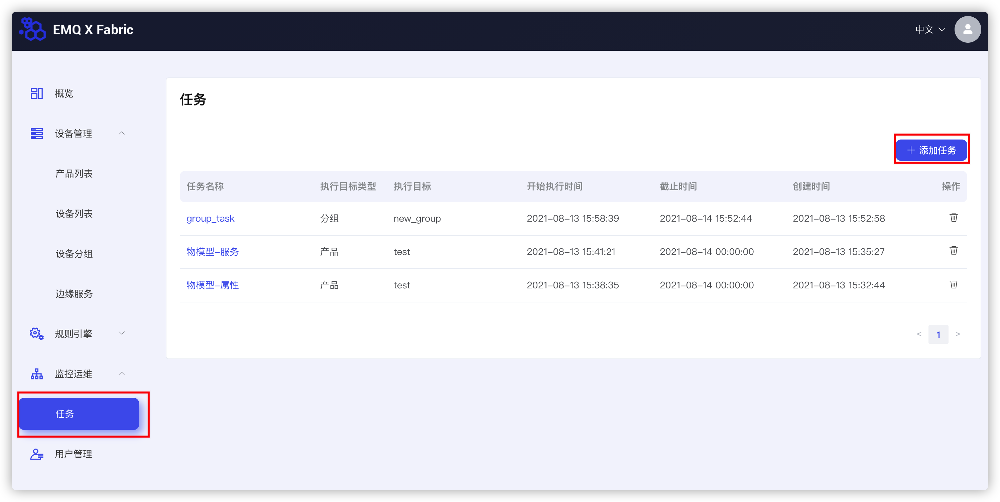
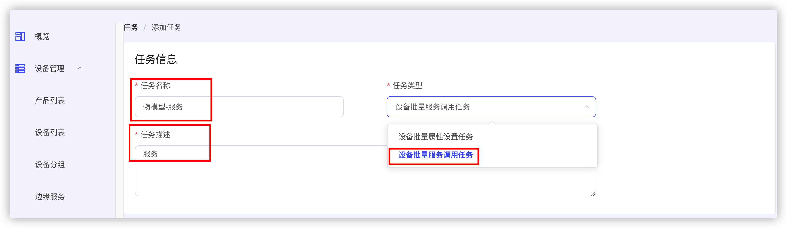
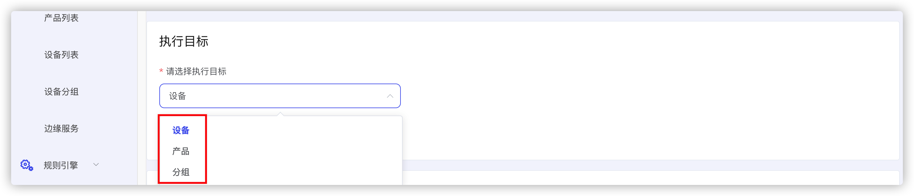
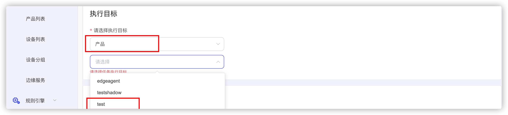
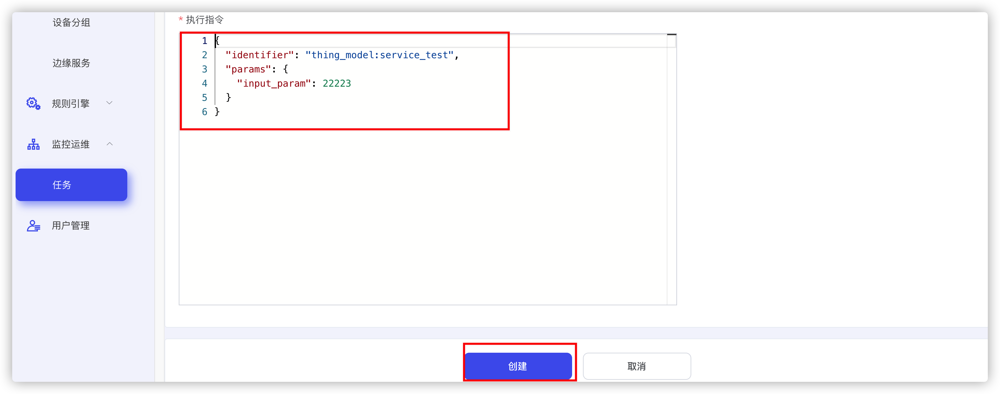
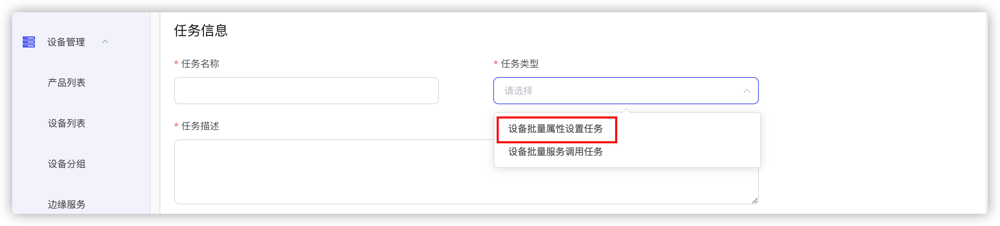
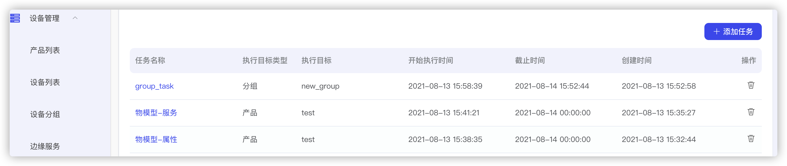
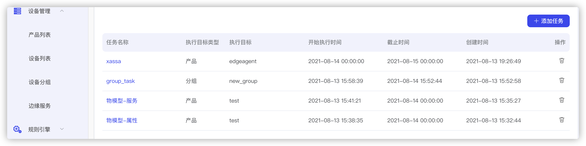
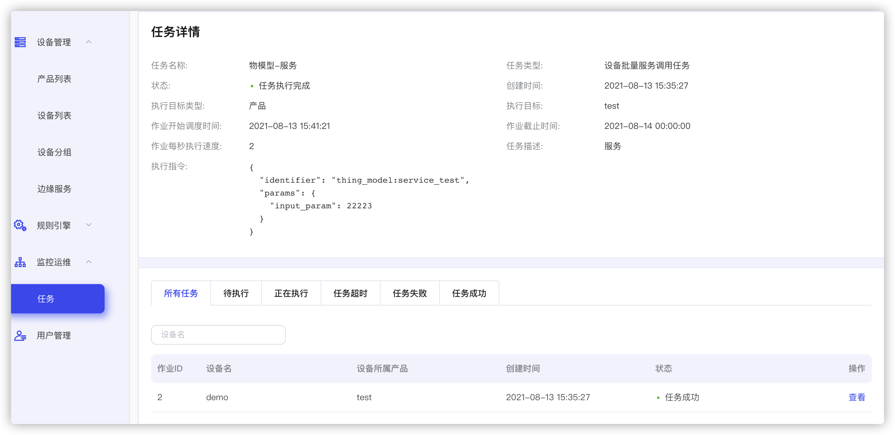

# 任务创建

## 前置要求

首先我们需要完成[创建产品]( ./create_device.md)和[创建设备](./create_product.md)，完成了[物模型创建](./create_thing_model.md)和[设备数据上报](./device_data_upload.md)。

## 创建批量服务任务

然后我们[Fabric]()平台点击任务，然后添加任务，如图



首先我们创建一个服务调用，添加任务名称，任务描述，选择任务类型为设备批量服务调用



执行目标可以通过**设备**，**产品**和**分组**三种方式进行选择。



我们这里以**产品**为例，这里选择我们刚才创建的物模型test。



选择作业的起止时间和频次。


然后添加响应的执行指令并创建。



下面是服务请求模版，() 中内容是需要替换的，根据你的TSL去替换对应的值。

```json

{
  "identifier": "(your model identifier:your service identifier)",
  "params": {
    "(your input identifer)": (your input value)
  }
}
```

## 创建批量属性设置任务

创建属性设置任务和创建批量服务基本相同，不同点主要有两点：

首先是任务类型的选择，选择**批量属性设置任务**



然后是执行的指令不同，下面是请求的模版

```json
{
  "params": {
    "(your model identifer):(your property)": (your property value),
  }
}
```



下面是我们所创建任务的列表



点进具体的任务就可以看到，对应任务的信息，执行状态

