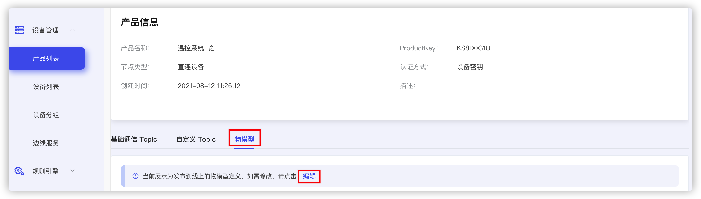
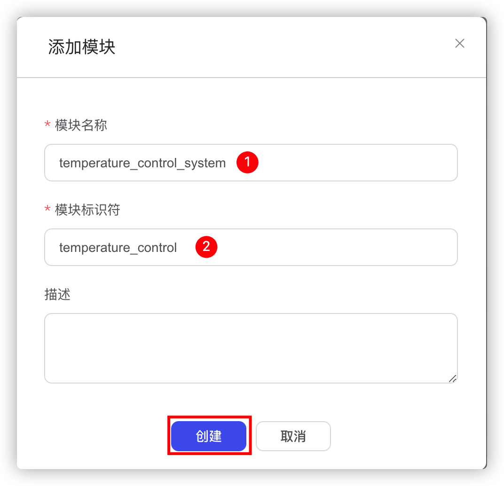

# 物模型定义

物模型为产品定义了三种基本抽象，属性，服务，事件，以便于边缘的产品与云端进行数据交互和管理。

## 创建产品

登陆 EMQ X Fabric 物联网平台，常见产品具体参见[创建产品](./create_product.md)

## 创建设备

创建设备具体参见[创建设备](./create_device.md)

## 创建物模型

下面我们以基于树莓派的温控系统为例，在上面的产品和设备都创建好以后，点击产品列表，查看刚刚创建好的设备。

选择物模型，点击编辑

首先添加模块，然后添加能力

下面是**添加模块**，填好模块名称和模块标识符然后单机创建，这里描述选填。我们的模块就添加好了，接下来我们就可以在模块的基础上添加功能

首先添加一个属性风扇级别，我们对风扇有三个档位的控制，可在云端下发设置属性，所以选择读写类型，然后点击创建，这样我们就创建好了一个属性。

点击发布服务端为我们生成了物模型的TSL，点击物模型我们即得到了刚才定义好的TSL，这里可以在线浏览，也可选择导出离线浏览。

然后根据生成的 TSL 修改设备端代码即可。
